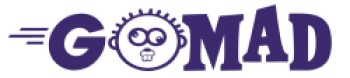

[](http://golang.com)
[](https://goreportcard.com/report/github.com/aclairefication/gomad)
[](LICENSE)
[](https://travis-ci.org/aclairefication/gomad)
[](https://codecov.io/gh/aclairefication/gomad)
[](https://www.codacy.com/app/aclairefication/gomad?utm_source=github.com&amp;utm_medium=referral&amp;utm_content=aclairefication/gomad&amp;utm_campaign=Badge_Grade)
[](https://coveralls.io/github/aclairefication/gomad?branch=master)

Go Mad! is a project explaining the different types of contract testing.

When you have multiple applications involved in a system, the interactions can be described as
* a consumer requesting (probably with parameters) from
* a provider that provides a result

The agreement between the consumer and provider applications about how to communicate is called the contract.

When we are composing contracts, we can start from either perspective:
Consumer-driven contracts
or
Provider-driven contracts.

### Consumer-Driven

Let's start with the "user" - in this case the consumer application!
When we take the point of view of a consumer, we call this consumer-driven.
The consumer wants to make a request of the provider in order to solve a problem (e.g. accomplish a task).
To be sure the provider continues to answer in a predictable format, the consumer can create a contract for the provider to fulfill. (This contract can be written cooperatively, but it's consumer-driven because the consumer is providing a contract to the provider.)

What makes consumer-driven desirable?
Like test-driven development (TDD), Consumer-Driven Contract Testing (CDCT) would allow writing only the code necessary for a particular use case of an application.

Check out the [consumer-driven folder](consumer-driven) for more details!

### Provider-Driven

What if we don't have a user yet? For example, we may anticipate future users when we open source this repo.
Let's start with the provider!
The provider wants to return a result to the consumer based on a particular solution - that hopefully matches the consumer's problem!

What makes provider-driven desirable?
You know you have a provider team, even if it's just you writing a solo project. You don't know whether anyone will use your "net new" contribution to the world in the form of this package/library/third party app.
You can decide to support only those use cases that you consider valuable.
You're already writing the application code - and hopefully the other test automation! - so adding one more type of test automation is not a heavy burden.

Check out the [provider-driven folder](provider-driven) for more details!

### Usage

To run against MadLib-like APIs
```
go run gomad.go wordblanks.go
```

To run go tests
```
go test -v ./...
```

Automated test script results & other automatic evaluations

[ Latest successful job](https://codescene.io/projects/4861/jobs/latest-successful/results)
